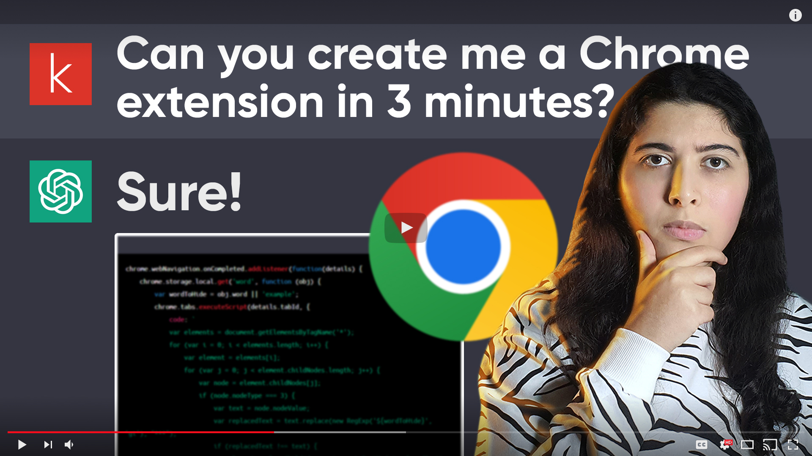
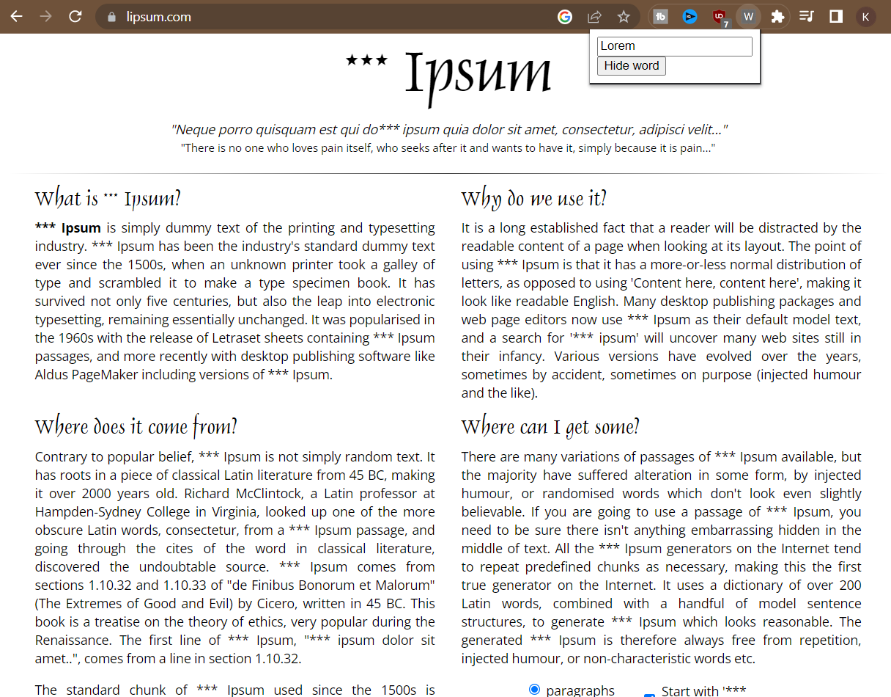

# ChatGPT Chrome Extension

In this video, I will use [OpenAI 's GPT-3](https://chat.openai.com/chat) to create a simple Chrome extension in less than 3 minutes! Watch as I explain the process and the outcome of using AI to write code. The Extension will hide a word I chose from a virtual interface in a web page.

## Output

Remember, AI tools like ChatGPT can be a helpful resource, but they cannot replace the expertise and experience of a professional programmer.

Use the output carefully and always review it before implementing it in a production environment.
